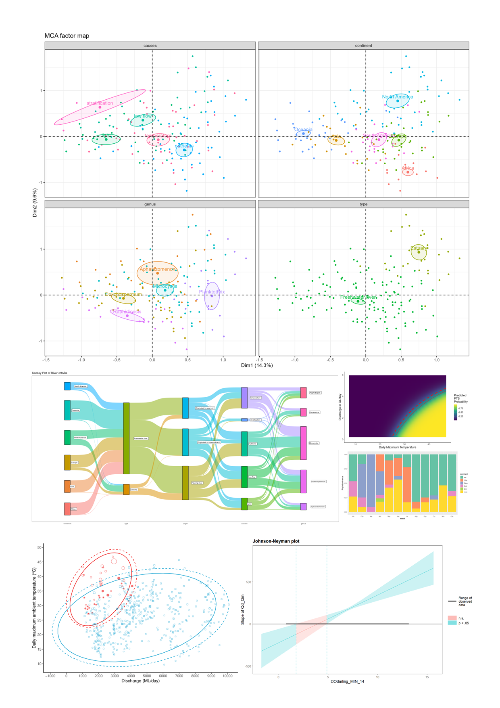

# 🌱 Dr. Jarrod Walton

**`Water Scientist (Educator, Data Scientist)`**

:earth_asia: I am an Australian researcher/teacher of science with a particular focus on ecology.  
:yin_yang: I feel equally at home in the field among nature as I do on the computer among nature's data.  
:beetle: I have a unrelenting attraction to trying new things but am ewually driven by the power of *things that just work*.  
:rocket: I believe a strong team is often greater than the sum of its parts, and my experience working across disciplines has proven just that.  
💻 I am foremost a researcher, but enjoy programming in my spare-time when the call from the great outdoors dims. 
<h3> Primary Tools and Languages</h3> 

 
<h1></h1>
<h3>Statistical Analysis and Modelling</h3>

<h4>Comparative Analyses</h4>
<li><strong>Linear Models</strong>: GLM, LRM, LMM, GLMM</li>
<li> Bayesian Models</li>
<li> ANOVA, ANCOVA, Chi-squared Analysis </li>

<h4>Time Series Analysis</h4>
<li>ARIMA</li>
<li>Break Point Analysis</li>
<li>Imputation</li>
<li>Decomposition, Lag, Rare Event Analysis</li>

<h4>Ordination Analyses</h4>
<li>PCA</li>
<li>RDA</li>
<li>nMDS (ANSOSIM and SIMPER)</li>
<li>MCA</li>

<h4>Data Exploration Wrangling</h4>
<li>Data Cleaning</li>
<li>Large datasets</li>
<li>3rd Party, multiple format, datasets</li>
<li>Multiple Factor Analysis</li>
<li>Decision Tree Analysis, Regression Tree Analysis, Random Forest Analysis</li>
     

<!--
DEV IMAGE SOURCE:
https://devicon.dev/

NOT USED at the moment

          

TO USE IN 
align="left" alt="C" width="30px" style="padding-right:10px;"
           
          
-->
